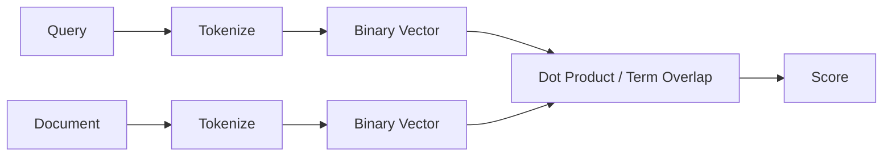
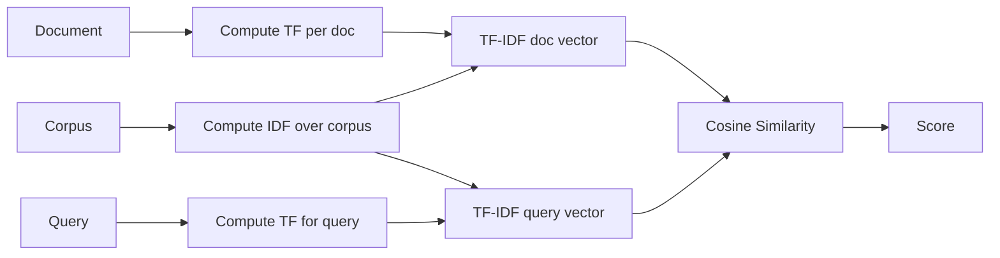
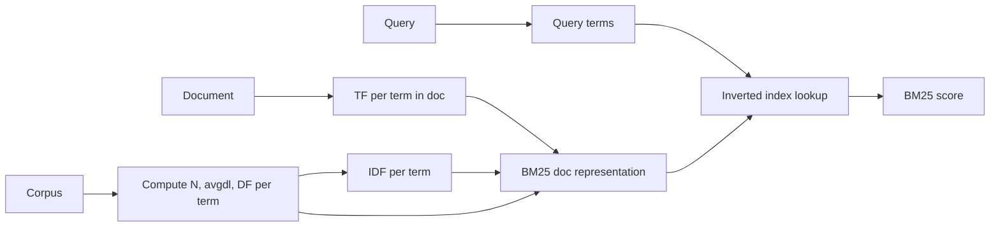
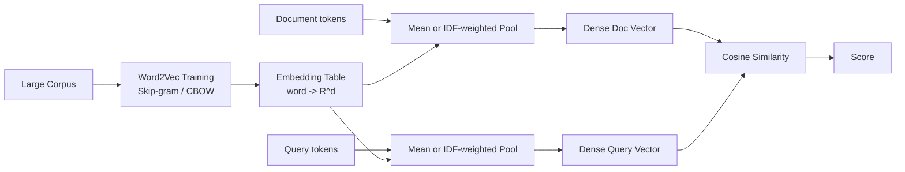
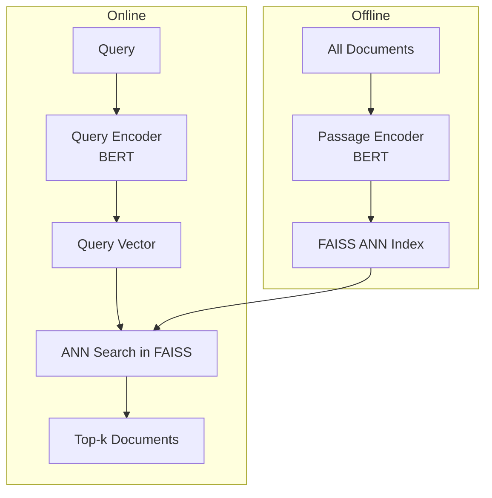
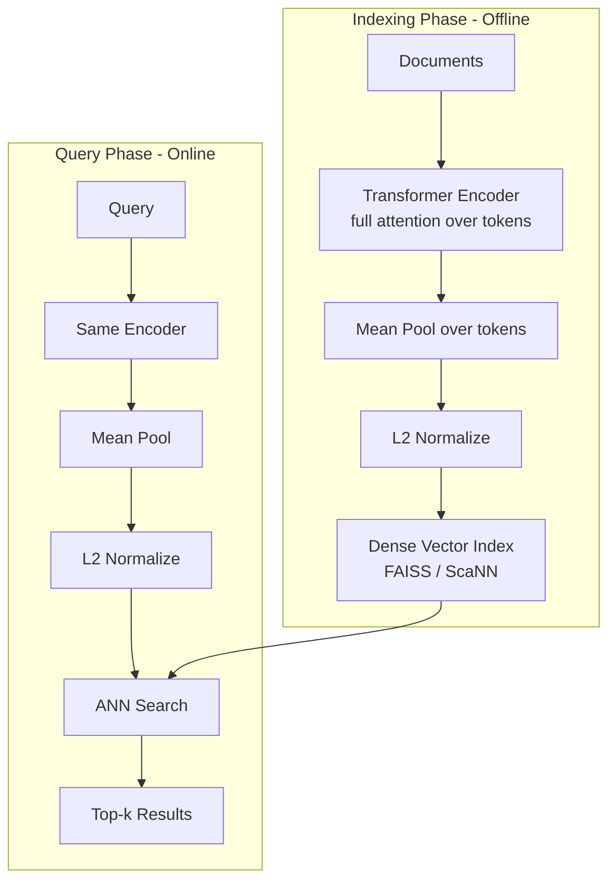
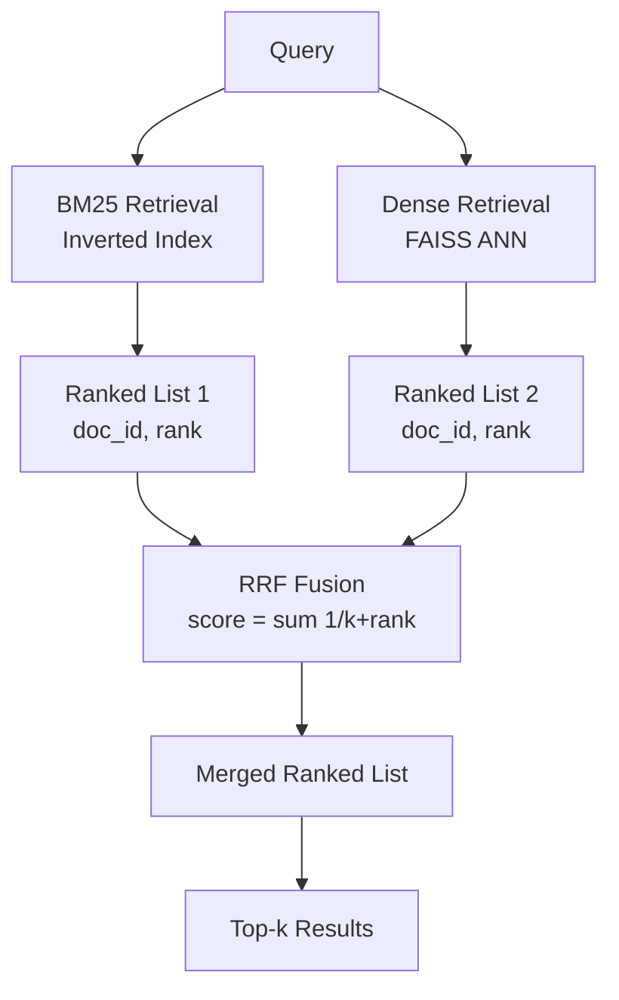
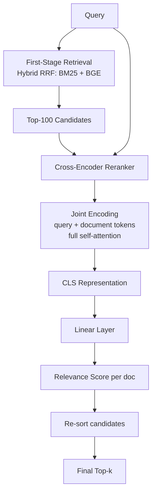

# Retrieval Model Reference

A reference document for the retrieval evolution study covering sparse, dense, and hybrid retrieval methods evaluated on BEIR benchmarks (TREC-COVID, FIQA, SciFact).

---

## Summary Table

| Method | Era | Category | TREC-COVID NDCG@10 |
|---|---|---|---|
| BOW | 1950s–60s | Sparse / Lexical | 0.176 |
| TF-IDF | 1970s | Sparse / Lexical | 0.287 |
| BM25 | 1994 | Sparse / Lexical | 0.447 |
| Word2Vec (mean) | 2013 | Dense / Static Embedding | 0.339 |
| Word2Vec (IDF-weighted) | 2013 | Dense / Static Embedding | 0.437 |
| DPR | 2020 | Dense / Bi-Encoder | — |
| MiniLM Bi-Encoder | 2020 | Dense / Bi-Encoder | 0.473 |
| MPNet Bi-Encoder | 2020 | Dense / Bi-Encoder | 0.513 |
| E5 Bi-Encoder | 2022 | Dense / Bi-Encoder | 0.696 |
| BGE Bi-Encoder | 2023 | Dense / Bi-Encoder | 0.781 |
| Hybrid RRF (BM25 + BGE) | 2023 | Hybrid | 0.710 |
| Hybrid + Cross-Encoder Reranker | 2023 | Hybrid + Reranking | 0.763 |

---

## 1. Bag of Words (BOW)

**Era:** 1950s–60s | **Category:** Sparse / Lexical

### Core Formula

$$
\text{BOW}(q, d) = \sum_{t \in q} \mathbf{1}[t \in d]
$$

Each document is represented as a binary vector over the vocabulary. Retrieval score is the count of query terms present in the document (no weighting).

### Pipeline

### Key Insight

Establishes the foundational term-matching paradigm. Any word appearing in a document is treated as a signal, regardless of frequency or document length. Enables exact-match retrieval over large corpora without semantic understanding.

### Known Limitations

- No term weighting: rare and common terms contribute equally.
- No document length normalization — longer documents score higher trivially.
- Vocabulary mismatch: synonyms and paraphrases are invisible.
- Representation space is extremely sparse (|V| dimensions).

### Observed Results

| Dataset | NDCG@10 |
|---|---|
| TREC-COVID | 0.176 |
| FIQA | 0.066 |
| SciFact | 0.365 |

---

## 2. TF-IDF

**Era:** 1970s | **Category:** Sparse / Lexical

### Core Formula

$$
\text{TF-IDF}(t, d, D) = \text{TF}(t, d) \times \text{IDF}(t, D)
$$

$$
\text{TF}(t, d) = \frac{f_{t,d}}{\sum_{t' \in d} f_{t',d}}, \quad \text{IDF}(t, D) = \log\frac{|D|}{|\{d \in D : t \in d\}|}
$$

$$
\text{Score}(q, d) = \sum_{t \in q} \text{TF-IDF}(t, d, D) \cdot \text{TF-IDF}(t, q, D)
$$

Cosine similarity over TF-IDF weighted vectors is standard practice.

### Pipeline

### Key Insight

Down-weights ubiquitous terms (high DF) and up-weights discriminative terms (low DF). Solves BOW's flat weighting by making rare, specific terms more influential in scoring.

### Known Limitations

- Still no document length normalization in the basic form.
- IDF is a corpus-level statistic — sensitive to corpus composition.
- No sub-word or morphological matching; inflections treated as different tokens.
- Vocabulary mismatch remains: no semantic generalisation.

### Paper Link

Jones, K.S. (1972). *A statistical interpretation of term specificity and its application in retrieval.* Journal of Documentation. Foundational reference; no arXiv.

### Observed Results

| Dataset | NDCG@10 |
|---|---|
| TREC-COVID | 0.287 |
| FIQA | 0.179 |
| SciFact | 0.629 |

---

## 3. BM25 (Okapi BM25)

**Era:** 1994 | **Category:** Sparse / Lexical

### Core Formula

$$
\text{BM25}(q, d) = \sum_{t \in q} \text{IDF}(t) \cdot \frac{f_{t,d} \cdot (k_1 + 1)}{f_{t,d} + k_1 \cdot \left(1 - b + b \cdot \frac{|d|}{\text{avgdl}}\right)}
$$

$$
\text{IDF}(t) = \log\frac{N - n_t + 0.5}{n_t + 0.5}
$$

Where $k_1 \in [1.2, 2.0]$ controls TF saturation, $b \in [0, 1]$ controls length normalization, $N$ = corpus size, $n_t$ = documents containing term $t$.

### Pipeline

### Key Insight

Introduces TF saturation (diminishing returns for repeated terms) and explicit document length normalization. The two hyperparameters $k_1$ and $b$ make the scoring function more robust across diverse document lengths and term distributions than TF-IDF.

### Known Limitations

- Purely lexical: exact term match required; no semantic generalisation.
- Hyperparameters $k_1$ and $b$ typically set to defaults (1.2–1.5, 0.75); domain-specific tuning rarely done.
- Treats query terms independently; no phrase or proximity modeling in standard form.
- Performance degrades significantly on domains with specialized vocabulary (biomedical, legal) due to vocabulary mismatch.

### Paper Link

Robertson, S. & Zaragoza, H. (2009). *The Probabilistic Relevance Framework: BM25 and Beyond.*
Survey: https://arxiv.org/abs/1503.08895

### Observed Results

| Dataset | NDCG@10 |
|---|---|
| TREC-COVID | 0.447 |
| FIQA | 0.159 |
| SciFact | 0.560 |

---

## 4. Word2Vec (Static Embeddings)

**Era:** 2013 | **Category:** Dense / Static Embedding

### Core Formula

**Mean pooling:**

$$
\vec{d} = \frac{1}{|d|} \sum_{w \in d} \vec{e}_w
$$

**IDF-weighted pooling:**

$$
\vec{d} = \frac{\sum_{w \in d} \text{IDF}(w) \cdot \vec{e}_w}{\sum_{w \in d} \text{IDF}(w)}
$$

**Retrieval score:**

$$
\text{Score}(q, d) = \cos(\vec{q}, \vec{d}) = \frac{\vec{q} \cdot \vec{d}}{\|\vec{q}\| \cdot \|\vec{d}\|}
$$

### Pipeline

### Key Insight

Moves from sparse lexical matching to continuous dense vector space. Semantically similar words are geometrically close: synonyms and related terms contribute to retrieval even without exact match. IDF weighting in pooling down-weights stop words.

### Known Limitations

- Context-free: each word has a single embedding regardless of usage context (no disambiguation).
- Pooling loses word order and document structure.
- Out-of-vocabulary words are unrepresented.
- Mean pooling over long documents produces noisy, averaged representations.
- Not trained on retrieval signal — embeddings optimized for language modeling, not relevance.

### Paper Link

Mikolov, T. et al. (2013). *Efficient Estimation of Word Representations in Vector Space.*
https://arxiv.org/abs/1301.3781

### Observed Results

| Method | TREC-COVID | FIQA | SciFact |
|---|---|---|---|
| Word2Vec Mean | 0.339 | 0.060 | 0.269 |
| Word2Vec IDF | 0.437 | 0.089 | 0.310 |

---

## 5. DPR (Dense Passage Retrieval)

**Era:** 2020 | **Category:** Dense / Bi-Encoder

### Core Formula

$$
\text{Score}(q, d) = E_Q(q)^\top E_P(d)
$$

Where $E_Q$ and $E_P$ are independent BERT-based encoders fine-tuned with in-batch negatives using a contrastive loss:

$$
\mathcal{L} = -\log \frac{e^{\text{sim}(q, d^+)}}{e^{\text{sim}(q, d^+)} + \sum_{j} e^{\text{sim}(q, d^-_j)}}
$$

### Pipeline

### Key Insight

First to train dual BERT encoders end-to-end with retrieval supervision using in-batch negatives. Demonstrates that retrieval-supervised dense encoders outperform BM25 on open-domain QA. Decouples question and passage encoders so document embeddings can be precomputed and indexed offline.

### Known Limitations

- Training requires labeled question-passage pairs; hard to extend to zero-shot domains.
- In-batch negatives are weak; hard negative mining is essential for high performance.
- Bi-encoder architecture prevents query-document interaction during encoding — expressiveness ceiling.
- Computationally expensive to encode and re-index large corpora.

### Paper Link

Karpukhin, V. et al. (2020). *Dense Passage Retrieval for Open-Domain Question Answering.*
https://arxiv.org/abs/2004.04906

---

## 6. Bi-Encoder Sentence Transformers (MiniLM, MPNet, BGE, E5)

**Era:** 2019–2023 | **Category:** Dense / Bi-Encoder

### Core Formula

$$
\text{Score}(q, d) = \cos\left( f_\theta(\text{[CLS]} \oplus q), \, f_\theta(\text{[CLS]} \oplus d) \right)
$$

Where $f_\theta$ is a transformer encoder with mean pooling (or [CLS] pooling), fine-tuned on (query, positive, negative) triplets via multiple negatives ranking loss or contrastive loss.

### Pipeline

### Key Insight

Sentence-BERT-style training produces general-purpose sentence embeddings that transfer to retrieval tasks. Later models (E5, BGE) introduce instruction-tuning, contrastive pre-training on large web corpora, and multi-stage fine-tuning, substantially closing the gap to supervised baselines.

### Model-Specific Notes

| Model | Base | Training Signal | Notes |
|---|---|---|---|
| MiniLM | MiniLM-L6 | NLI + MSMARCO | 6-layer distilled model; fast, low memory |
| MPNet | MPNet-base | NLI + MSMARCO | Combined MLM + permuted language modeling |
| E5 | DeBERTa / E5-large | Weakly supervised web data + fine-tune | Instruction-prefixed queries ("query: ...") |
| BGE | BERT-large | RetroMAE pre-training + fine-tune | BAAI General Embedding; strong multilingual |

### Known Limitations

- No token-level query-document interaction — query and document encoded independently.
- Performance is sensitive to domain shift; biomedical or legal domains may need domain-specific models.
- Memory-intensive for large corpora (768-dim or 1024-dim vectors at billion scale).
- Instruction-tuned models (E5) require correct prompt prefixes at inference time.

### Paper Links

- Sentence-BERT (SBERT): https://arxiv.org/abs/1908.10084
- MiniLM: https://arxiv.org/abs/2002.10957
- MPNet: https://arxiv.org/abs/2004.09297
- E5: https://arxiv.org/abs/2212.03533
- BGE: https://arxiv.org/abs/2309.07597

### Observed Results

| Model | TREC-COVID | FIQA | SciFact |
|---|---|---|---|
| MiniLM | 0.473 | 0.369 | 0.645 |
| MPNet | 0.513 | 0.500 | 0.656 |
| E5 | 0.696 | 0.399 | 0.719 |
| BGE | 0.781 | 0.406 | 0.740 |

---

## 7. Hybrid Retrieval with Reciprocal Rank Fusion (RRF)

**Era:** 2009 (RRF), widely adopted 2022–2023 | **Category:** Hybrid

### Core Formula

$$
\text{RRF}(d) = \sum_{r \in R} \frac{1}{k + \text{rank}_r(d)}
$$

Where $R$ is the set of rankers (e.g., BM25 and BGE), $\text{rank}_r(d)$ is document $d$'s rank in ranker $r$'s result list, and $k$ is a smoothing constant (typically 60).

This is rank-based fusion — no score normalization required, making it robust when rankers operate on different score scales.

### Pipeline

### Key Insight

Combines lexical precision (BM25 catches exact-match, high-specificity queries) with semantic recall (dense retrieval handles paraphrases, synonyms). RRF is score-agnostic and surprisingly competitive with learned fusion approaches. The combination is complementary: queries where BM25 fails are often well-handled by dense retrieval and vice versa.

### Known Limitations

- Rank-based fusion discards score magnitude — two documents at rank 1 from different systems are treated equally regardless of score gap.
- Does not learn to weight systems based on query type; equal weighting may be suboptimal.
- Retrieval from both systems doubles latency and memory footprint.
- Fusing more than two rankers shows diminishing returns in most benchmarks.

### Paper Link

Cormack, G. et al. (2009). *Reciprocal Rank Fusion outperforms Condorcet and individual rank learning methods.*
ACL/SIGIR reference; RRF formula is widely cited in BEIR and retrieval literature.

### Observed Results

| Dataset | NDCG@10 |
|---|---|
| TREC-COVID | 0.710 |
| FIQA | 0.292 |
| SciFact | 0.667 |

---

## 8. Cross-Encoder Reranker

**Era:** 2019–2020 | **Category:** Reranking (Two-Stage)

### Core Formula

$$
\text{Score}(q, d) = f_\theta(\text{[CLS]} \oplus q \oplus \text{[SEP]} \oplus d)
$$

Query and document are concatenated and jointly encoded through the full transformer. The [CLS] representation is passed through a linear classifier to produce a relevance score.

$$
\hat{y} = \sigma(W \cdot h_{\text{[CLS]}} + b)
$$

### Pipeline

### Key Insight

Solves the fundamental expressiveness limitation of bi-encoders: by encoding query and document jointly, every query token can attend to every document token. This enables fine-grained matching (negation, entity disambiguation, positional cues) invisible to independently encoded representations. Used as a second stage over a retrieved shortlist to avoid O(N) full-corpus inference.

### Known Limitations

- Cannot be applied to full corpora directly — quadratic complexity in corpus size.
- Latency is proportional to the number of candidates reranked; impractical beyond ~200 candidates per query in real-time settings.
- Requires the first-stage retrieval to have high recall; reranker cannot recover missing relevant documents.
- Sensitive to truncation: joint encoding is limited by maximum sequence length (typically 512 tokens).

### Paper Links

- MonoBERT / Passage Reranking with BERT: https://arxiv.org/abs/1901.04085
- MS MARCO reranking (Nogueira & Cho, 2019): https://arxiv.org/abs/1901.04085

### Observed Results (Hybrid RRF first stage)

| Dataset | NDCG@10 |
|---|---|
| TREC-COVID | 0.763 |
| FIQA | 0.374 |
| SciFact | 0.689 |

---

## 9. Evaluation Metrics

### NDCG@k (Normalized Discounted Cumulative Gain)

$$
\text{DCG@k} = \sum_{i=1}^{k} \frac{\text{rel}_i}{\log_2(i+1)}
$$

$$
\text{NDCG@k} = \frac{\text{DCG@k}}{\text{IDCG@k}}
$$

Where IDCG@k is the DCG@k of the ideal (perfect) ranking. $\text{rel}_i \in \{0, 1, 2\}$ for graded relevance (BEIR uses binary or three-level). NDCG@k $\in [0, 1]$; higher is better.

**Why NDCG@k:** Rewards placing highly relevant documents near the top of the ranked list, with logarithmic discount for lower ranks. The normalization makes scores comparable across queries with different numbers of relevant documents.

---

### MRR@k (Mean Reciprocal Rank)

$$
\text{MRR@k} = \frac{1}{|Q|} \sum_{q \in Q} \frac{1}{\text{rank}_q^{\text{first relevant}}}
$$

Where $\text{rank}_q^{\text{first relevant}}$ is the rank of the first relevant document for query $q$, capped at $k$ (set to 0 if no relevant document appears in top-k).

**Why MRR@k:** Measures whether the system can surface at least one relevant document quickly. Commonly used in QA and conversational retrieval where a single relevant answer is sufficient.

---

### MAP@k (Mean Average Precision)

$$
\text{AP@k}(q) = \frac{1}{|\text{Rel}_q|} \sum_{i=1}^{k} P@i \cdot \mathbf{1}[\text{doc}_i \text{ is relevant}]
$$

$$
\text{MAP@k} = \frac{1}{|Q|} \sum_{q \in Q} \text{AP@k}(q)
$$

Where $P@i$ is precision at rank $i$ and $|\text{Rel}_q|$ is the total number of relevant documents for query $q$.

**Why MAP@k:** Captures precision at every recall level — rewards systems that retrieve many relevant documents early. Sensitive to the completeness of relevance judgments.

---

### Recall@k

$$
\text{Recall@k}(q) = \frac{|\text{Relevant docs in top-k}|}{|\text{Total relevant docs for } q|}
$$

$$
\text{Recall@k} = \frac{1}{|Q|} \sum_{q \in Q} \text{Recall@k}(q)
$$

**Why Recall@k:** Measures coverage — did the system retrieve all relevant documents within the top-k? Critical for pipeline systems where a second-stage reranker can only work with what the first stage retrieves. High Recall@100 at the retrieval stage is a prerequisite for good reranker performance.

---

### Metric Summary

| Metric | Sensitive To | Use Case |
|---|---|---|
| NDCG@k | Rank and graded relevance | General-purpose ranking quality |
| MRR@k | Position of first relevant | Single-answer retrieval, QA |
| MAP@k | Precision across recall levels | Multi-document retrieval |
| Recall@k | Coverage in top-k | First-stage / retrieval pipeline |

---

*Reference: BEIR benchmark for evaluation — https://arxiv.org/abs/2104.08663*
